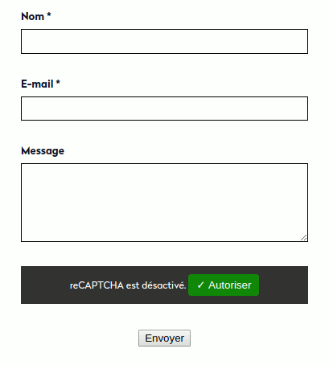

# cf7-tac-recaptcha

A WordPress plugin to handle ContactForm7 reCaptcha feature with TarteAuCitron.

**Disclaimer:** I’m publishing this here because it might be useful to others,
but USE OF THIS SCRIPT IS ENTIRELY AT YOUR OWN RISK. I accept no liability from its use.  
That said, I’m using this plugin for several clients and I’m interested in any feature
or security improvement. So please contact me for this kind of requests.

## Compatibility

This plugin is now compatible with reCAPTCHA v2 and v3.

## Installation

You can drop the plugin folder in your `wp-content/plugins` or `wp-content/mu-plugins` directory.  
I recommend using `wp-content/mu-plugins` because that plugin is related to the content structure, so
it shouldn’t be managed by site admin like features (`plugins`) or appearance (`themes`).

If you use the `mu-plugins` directory, don’t forget to require it from an upper-level file
like `/wp-content/mu-plugins/index.php`:

```php
require_once __DIR__ .'/cf7-tac-recaptcha/cf7-tac-recaptcha.php';
```

## Configuration

By default, this plugin assumes that you enqueued the TarteAuCitron script with the handle `tac`
and use that handle to add its scripts. You can change that handle by using the filter
`cf7_tac_recpatcha_tac_handle`:
 
```php
add_filter('cf7_tac_recpatcha_tac_handle', function () {
    return 'tarteaucitron';
});
```

That’s all! The plugin will replace the reCaptcha script used by [ContactForm7][cf7] with the
corresponding [TarteAuCitron][tac] calls.



## Support

I’m interested in any feedback.

## Author

Jérôme Mulsant [https://rue-de-la-vieille.fr](https://rue-de-la-vieille.fr)

[tac]: https://github.com/AmauriC/tarteaucitron.js/
[cf7]: http://contactform7.com/